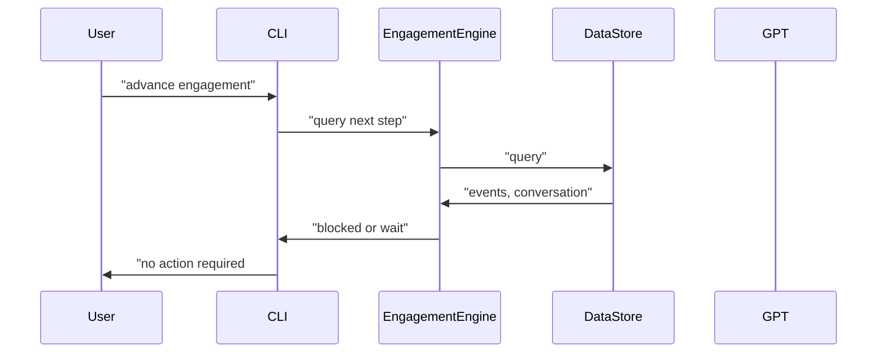
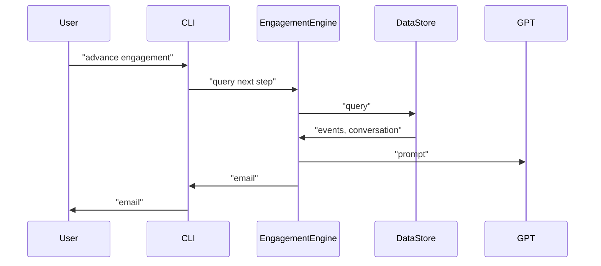
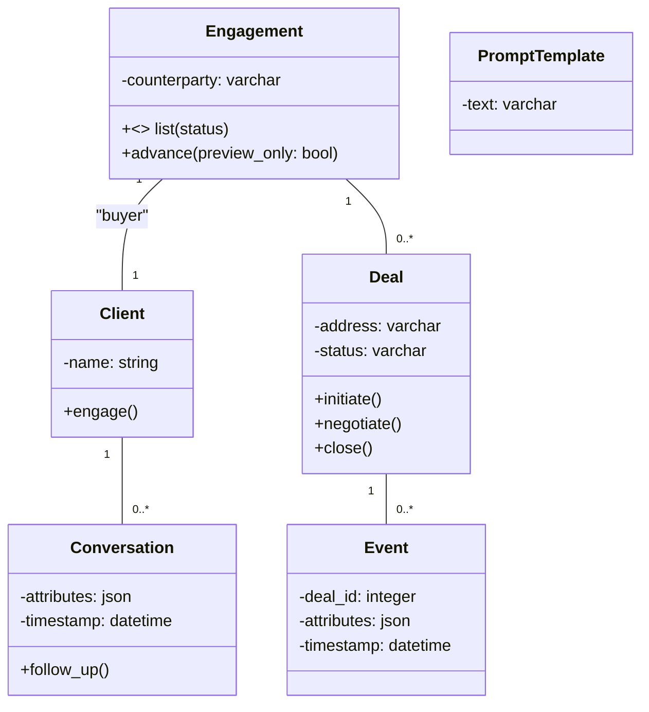

# email-assistant

## Commands
* `client`
  * `engage`
  * `list`
* `engagment`
  * `list`
  * `advance [--preview-only]`
* `deal`
  * `explore`
  * `negotiate`
  * `close`

## Diagrams
### No Action Required

### Send Email

### Persistence

 
## Sample conversations
* "Deal-less"
  * Provide market analysis (general)
  * Reply to an engagement request (inbound)
  * Reach out to prospect (outbound)
  * First meeting (introduce set of potential deals)
* Explore a potential deal
  * Local market analysis
  * More information about the property
  * Sway toward purchase
* Negotiation
  * Price-based
  * Property history
  * Requests to fix
  * Bidding war
* Closing
  * Facilitating funds transfer
  * Taking possession
  * Celebration

## Simplifying Assumptions
* Client is only engaged as a buyer (therefore representing one side of the deal)
* 1 deal per conversation