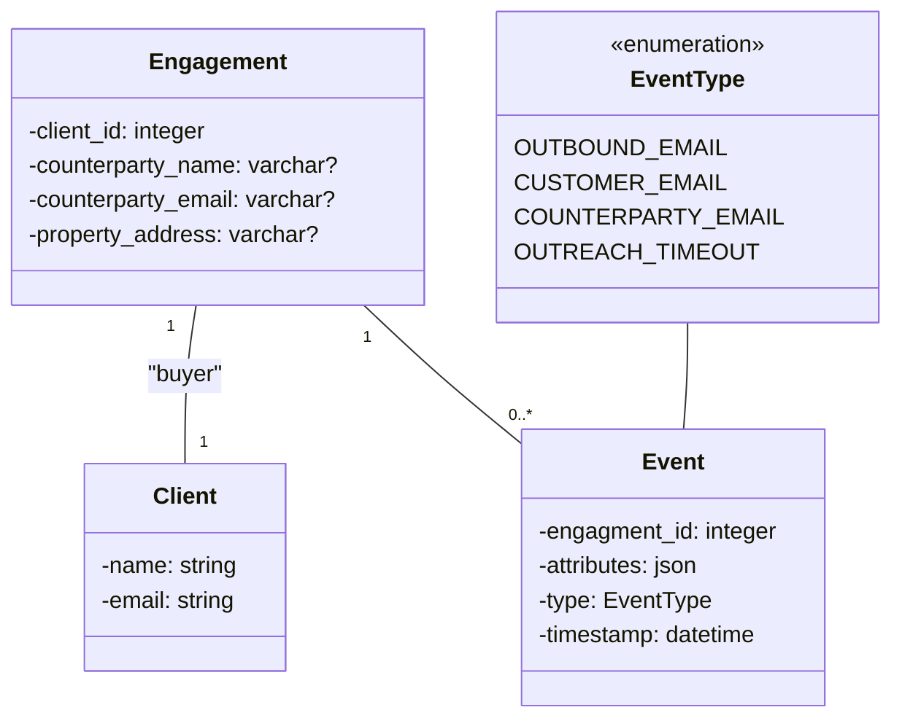
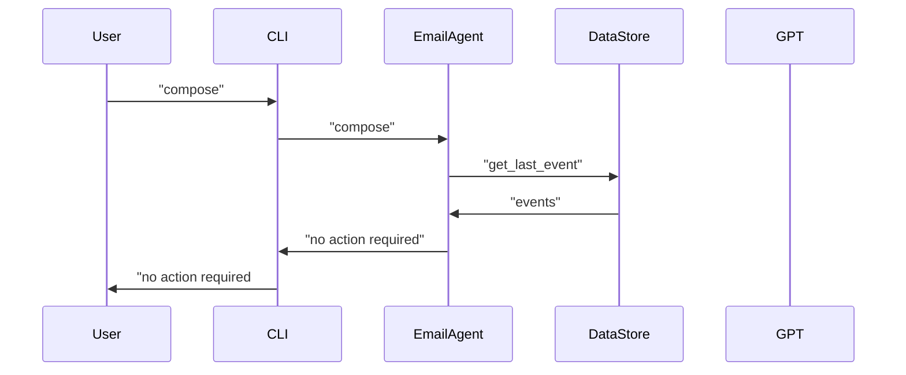
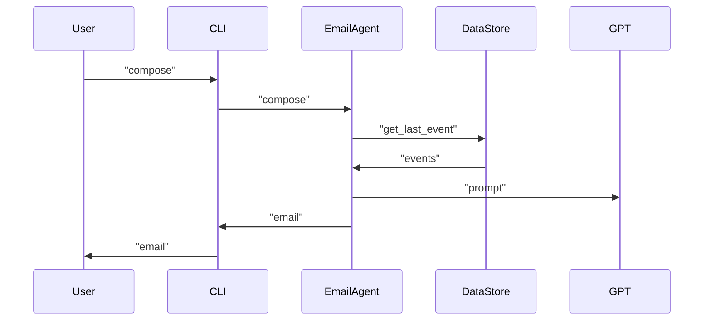

# Email Agent

## Setup
* Clone this repository
* ```pip install -r requirements.txt``` (Developed using Python3.12)
* Create `.env` in the root of the repository following `.env.example`:
  * `AGENT_NAME`: full name of the real estate agent to use in emails
  * `STORE_PATH`: local destination for the sqlite database file
  * `OPENAI_KEY`: key to use with ChatGPT
  * `OPENAI_MODEL` [Optional]: name of ChatGPT model to use
  * `OPESNAI_TEMPERATURE` [Optional]: temperature to request from ChatGPT

## Simplifying Assumptions
* Client is only engaged as a buyer, so counterparty is always the seller
* Single engagement per client, always "active"
* Event timeouts (e.g. 2 weeks since last response) are calculated by external backgrounder

## Commands
* `environment`
  * `reset`
* `client`
  * `list`
  * `engage`
* `engagement`
  * `list`
  * `compose [--dry-run]`
  * `counterparty`
* `event`
  * `list`
  * `receive-email`
  * `timeout`

## Diagrams
### Persistence


### No Action Required


### Send Email


## Samples of exchanges that inspired the design
* "Deal-less"
  * Provide market analysis (general)
  * Reply to an engagement request (inbound)
  * Reach out to prospect (outbound)
  * First meeting (introduce set of potential deals)
* Explore a potential deal
  * Local market analysis
  * More information about the property
  * Sway toward purchase
* Negotiation
  * Price-based
  * Property history
  * Requests to fix
  * Bidding war
* Closing
  * Facilitating funds transfer
  * Taking possession
  * Celebration